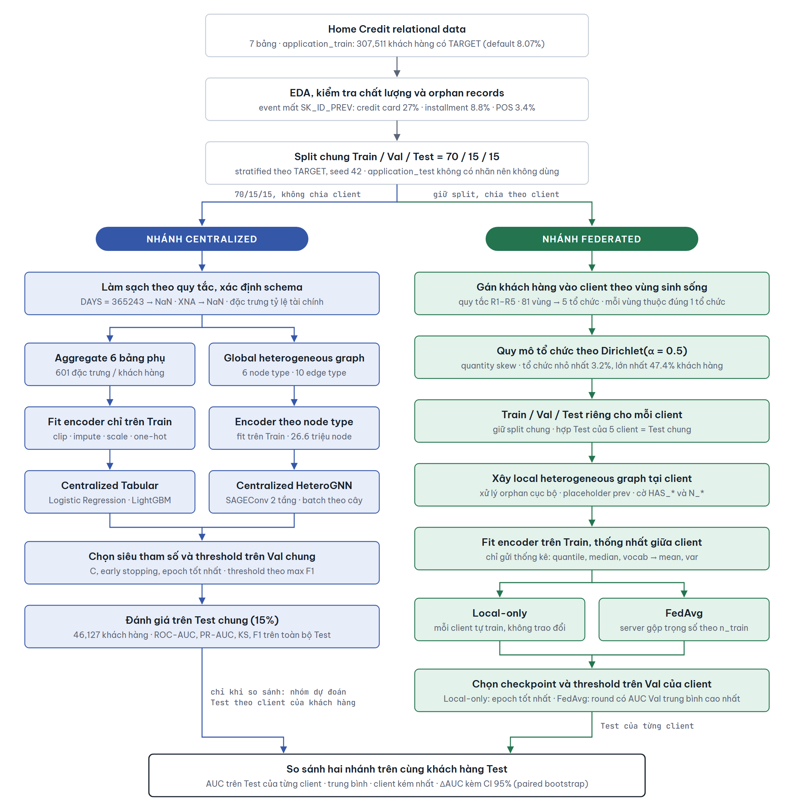

# Personalized Federated Heterogeneous Graph Learning for Credit Risk Prediction

Khóa luận tốt nghiệp: dự đoán khả năng vỡ nợ của khách hàng vay tiêu dùng trên bộ dữ liệu
[Home Credit Default Risk](https://www.kaggle.com/competitions/home-credit-default-risk).

Dự án trả lời ba câu hỏi:

1. Biểu diễn dữ liệu tín dụng dạng **heterogeneous graph** (khách hàng, hồ sơ vay trước, lịch sử
   tín dụng, từng kỳ trả góp...) có giúp dự đoán tốt không, so với mô hình bảng truyền thống?
2. Khi dữ liệu nằm ở **nhiều tổ chức tín dụng** không được chia sẻ dữ liệu khách hàng cho nhau,
   **Federated Learning** (chỉ trao đổi trọng số mô hình) có tốt hơn việc mỗi tổ chức tự train không,
   và kém bao nhiêu so với gom dữ liệu về một chỗ?
3. **Personalized FL** (mỗi tổ chức có mô hình được cá nhân hóa) có tốt hơn FedAvg không?

## Kết quả chính

Mọi mô hình được đánh giá trên **cùng một tập Test** gồm 46,127 khách hàng (tỷ lệ vỡ nợ 8.07%).
Nhánh Federated mô phỏng 5 tổ chức tín dụng, mỗi tổ chức phụ trách một nhóm vùng địa lý.

| Vai trò | Mô hình | ROC-AUC trên toàn bộ Test | AUC trung bình theo tổ chức | AUC của tổ chức kém nhất |
|---|---|---|---|---|
| Gom dữ liệu (cận trên) | Logistic Regression | 0.7832 | 0.7823 | 0.7719 |
| Gom dữ liệu (cận trên) | LightGBM | **0.7931** | **0.7900** | **0.7834** |
| Gom dữ liệu (cận trên) | HeteroGNN | 0.7858 | 0.7839 | 0.7752 |
| Mỗi tổ chức tự train (cận dưới) | Local-only HeteroGNN | 0.7673 | 0.7621 | 0.7463 |
| Federated Learning | FedAvg HeteroGNN | 0.7836 | 0.7803 | 0.7731 |
| Personalized FL | FedAvg + Fine-tune | 0.7826 | 0.7798 | 0.7731 |
| Personalized FL | FedProx | 0.7794 | 0.7775 | 0.7671 |
| Personalized FL | FedPer | 0.7814 | 0.7804 | 0.7732 |
| Personalized FL | Ditto | 0.7817 | 0.7818 | 0.7747 |

"AUC trung bình theo tổ chức" coi 5 tổ chức quan trọng như nhau. Các mô hình "gom dữ liệu" được train
một lần trên toàn bộ dữ liệu; cột theo tổ chức chỉ là AUC của cùng mô hình đó tính trên khách hàng của
từng tổ chức.

Tóm tắt:

- **Hợp tác có lợi:** FedAvg tốt hơn Local-only ở 4/5 tổ chức, có ý nghĩa thống kê (khoảng tin cậy 95%
  bằng paired bootstrap). Lợi ích lớn nhất ở các tổ chức nhỏ.
- **Bảo mật gần như không tốn chi phí:** FedAvg không khác biệt có ý nghĩa so với HeteroGNN train trên
  dữ liệu gom chung, ở cả 5 tổ chức.
- **Cá nhân hóa chưa tạo khác biệt rõ:** không phương pháp Personalized FL nào tốt hơn FedAvg có ý nghĩa
  thống kê. Ditto cải thiện 3 tổ chức nhỏ nhất và có AUC tổ chức kém nhất cao nhất nhóm Federated, nhưng
  giảm nhẹ ở tổ chức lớn nhất. Trong kịch bản này FedAvg đã gần chạm cận trên nên còn ít chỗ để cải thiện.
- Kết quả hiện mới chạy với **1 seed**.

Chi tiết đầy đủ (bảng theo từng tổ chức, khoảng tin cậy, thảo luận) nằm trong
[báo cáo tiến độ](docs/Bao_cao_tien_do_KLTN.pdf).

## Pipeline



Hai nhánh dùng **chung một cách chia** Train / Validation / Test = 70 / 15 / 15 lấy từ
`application_train.csv`. File `application_test.csv` của Kaggle không có nhãn nên không được dùng để đánh giá.

- **Nhánh Centralized** dùng toàn bộ dữ liệu, không chia tổ chức. Đây là mức tốt nhất có thể khi bỏ qua
  ràng buộc bảo mật.
- **Nhánh Federated** chia khách hàng cho 5 tổ chức. Mỗi tổ chức giữ phần Train / Validation / Test của mình,
  nên hợp Test của 5 tổ chức đúng bằng Test chung.

## Các thiết kế chính

### Heterogeneous graph

Graph được dựng trực tiếp từ các bảng quan hệ theo khóa ngoại, kèm cạnh ngược để thông tin đi hai chiều.

| Node | Định danh | Ý nghĩa | Số node |
|---|---|---|---|
| customer | `SK_ID_CURR` | Hồ sơ vay hiện tại | 307,511 |
| bureau | `SK_ID_BUREAU` | Khoản tín dụng ở tổ chức khác (đã gộp `bureau_balance`) | 1,465,325 |
| prev | `SK_ID_PREV` | Hồ sơ vay trước đây tại Home Credit | 1,453,595 |
| installment | theo sự kiện | Một kỳ trả góp | 11,591,592 |
| pos | theo tháng | Bản ghi POS / tiền mặt | 8,543,375 |
| cc | theo tháng | Bản ghi thẻ tín dụng | 3,227,965 |

Cạnh: `customer → bureau`, `customer → prev`, `prev → installment / pos / cc`, và 5 cạnh ngược tương ứng.

Mỗi bản ghi lịch sử chỉ thuộc một khách hàng, nên graph gồm nhiều cây tách rời: mỗi khách hàng là gốc của
một cây. Hệ quả là không có thông tin đi từ khách hàng Test sang khách hàng Train qua graph, và chia graph
theo tổ chức không làm mất cạnh nào.

### Dữ liệu "mồ côi" (orphan records)

| Trường hợp | Mức độ | Cách xử lý |
|---|---|---|
| Kỳ trả góp / thẻ / POS trỏ tới hồ sơ vay trước không tồn tại | 27% dòng thẻ tín dụng, 8.8% kỳ trả góp, 3.4% POS | Tạo node hồ sơ vay "giữ chỗ" (`IS_PLACEHOLDER = 1`) làm node cha |
| Hồ sơ vay trước không có lịch sử trả | 565,528 hồ sơ, chủ yếu bị từ chối hoặc hủy | Không phải lỗi; giữ node, thêm đặc trưng số node con và cờ `HAS_*` |
| Khách hàng không có lịch sử nào | 2,200 khách hàng | Giữ node; mô hình dùng đặc trưng của chính khách hàng |
| `bureau_balance` không trỏ tới `bureau` nào | 3.1 triệu dòng | Bỏ, vì không nối được về khách hàng |

### Chia dữ liệu cho các tổ chức

Kịch bản chính `region_territory_a0.5` mô phỏng 5 tổ chức tín dụng hoạt động theo địa bàn:

1. **Vùng sinh sống quyết định khách hàng thuộc tổ chức nào.** Cột `REGION_POPULATION_RELATIVE` có 81 giá trị,
   mỗi giá trị ứng với đúng một `REGION_RATING_CLIENT`, nên được dùng làm mã vùng. Mỗi vùng do đúng một tổ
   chức phụ trách.
2. **Dirichlet(α = 0.5) quyết định quy mô mỗi tổ chức** (quantity skew). Tổ chức nhỏ nhất có 3.2% khách
   hàng, lớn nhất 47.4%.
3. Toàn bộ lịch sử của khách hàng đi theo tổ chức sở hữu khách hàng đó.

Khác biệt giữa các tổ chức về đặc trưng (thu nhập, điểm tín dụng `EXT_SOURCE`...) xuất hiện tự nhiên từ các
vùng mà tổ chức phụ trách. Tỷ lệ vỡ nợ chỉ chênh nhẹ (7.6% – 9.3%), sát với thực tế.

Kịch bản phụ `label_dirichlet_a0.5` chia theo nhãn (Dirichlet trên `TARGET`), cho ra một tổ chức có 72% khách
hàng vỡ nợ. Kịch bản này phi thực tế và chỉ được giữ làm stress test.

### Federated Learning

- **Encoder thống nhất:** mỗi tổ chức chỉ gửi thống kê tổng hợp (quantile, median, danh mục, tổng và tổng
  bình phương), không gửi dữ liệu. Nhờ đó mọi tổ chức có cùng không gian đặc trưng.
- **Baseline:** Local-only (mỗi tổ chức tự train, không trao đổi) và FedAvg.
- **Personalized FL:**

| Phương pháp | Phần được cá nhân hóa |
|---|---|
| FedAvg + Fine-tune | Toàn bộ mô hình, train thêm tại tổ chức sau khi FedAvg hội tụ |
| FedProx | Không cá nhân hóa; thêm số hạng phạt để ổn định khi dữ liệu khác nhau |
| FedPer | Head phân loại riêng ở từng tổ chức, phần còn lại dùng chung |
| Ditto | Mỗi tổ chức có mô hình riêng, được kéo về gần mô hình chung |

- Checkpoint và threshold chọn trên Validation của từng tổ chức; Test chỉ dùng để đánh giá một lần.

## Cài đặt

Yêu cầu: Python 3.12, khoảng **16 GB RAM**, khoảng 10 GB ổ đĩa trống. Toàn bộ thí nghiệm chạy được trên CPU.

```bash
python -m pip install -r requirements.txt
```

Tải dữ liệu từ [Kaggle](https://www.kaggle.com/competitions/home-credit-default-risk/data) và giải nén toàn bộ
file CSV vào:

```
data/raw/home-credit-default-risk/
├── application_train.csv
├── application_test.csv
├── bureau.csv
├── bureau_balance.csv
├── previous_application.csv
├── installments_payments.csv
├── POS_CASH_balance.csv
└── credit_card_balance.csv
```

## Cách chạy

Chạy theo thứ tự. Thời gian đo trên CPU 16 luồng.

| Bước | Lệnh | Làm gì | Thời gian |
|---|---|---|---|
| 1 | `python scripts/01_preprocess.py` | Làm sạch, tạo 601 đặc trưng bảng, tạo split chung 70/15/15 | ~3 phút |
| 2 | `python scripts/04a_train_centralized.py` | Train Logistic Regression và LightGBM | ~12 phút |
| 3 | `python scripts/03a_build_centralized_graph.py` | Dựng graph toàn cục, kiểm tra orphan records | ~3 phút |
| 4 | `python scripts/04b_train_centralized_gnn.py` | Train HeteroGNN trên graph toàn cục | ~5 phút |
| 5 | `python scripts/02_partition_clients.py` | Chia khách hàng cho 5 tổ chức | vài giây |
| 6 | `python scripts/03_build_graphs.py` | Dựng graph cục bộ cho từng tổ chức, encoder thống nhất | ~4 phút |
| 7 | `python scripts/04_train_federated.py` | Train Local-only, FedAvg và 4 phương pháp Personalized FL | ~3 giờ |
| 8 | `python scripts/05_evaluate.py` | So sánh mọi mô hình trên Test của từng tổ chức, kèm khoảng tin cậy | ~12 phút |

Một số tùy chọn:

```bash
# Chỉ train một vài phương pháp (fedavg_ft cần FedAvg chạy trước hoặc đã có checkpoint)
python scripts/04_train_federated.py --methods fedavg ditto

# Chạy cho kịch bản chia khác (bước 5 đến 8)
python scripts/02_partition_clients.py --scenario label_dirichlet_a0.5
python scripts/03_build_graphs.py      --scenario label_dirichlet_a0.5
python scripts/04_train_federated.py   --scenario label_dirichlet_a0.5 --methods local fedavg
python scripts/05_evaluate.py          --scenario label_dirichlet_a0.5
```

Siêu tham số nằm trong `configs/`:

| File | Nội dung |
|---|---|
| `config.yaml` | Đường dẫn, seed, tỷ lệ split, tiêu chí chọn threshold |
| `model.yaml` | Logistic Regression, LightGBM, HeteroGNN |
| `graph.yaml` | Cách xử lý orphan records, encoder theo node type |
| `partition.yaml` | Các kịch bản chia tổ chức |
| `federated.yaml` | Local-only, FedAvg, Fine-tune, FedProx, FedPer, Ditto, bootstrap |

## Cấu trúc thư mục

```
configs/            Siêu tham số và kịch bản thí nghiệm
data/raw/           Dữ liệu Kaggle (không đưa lên git)
data/processed/     Đặc trưng, split, graph đã dựng (tạo bởi script, không đưa lên git)
docs/               Báo cáo tiến độ và sơ đồ pipeline
results/metrics/    Kết quả dạng JSON / CSV
results/logs/       Log của các lần chạy
scripts/            Các bước của pipeline, chạy theo số thứ tự
src/
  preprocessing/    Làm sạch, aggregate bảng phụ, encoder (fit chỉ trên Train)
  graph/            Schema, dựng node/cạnh, xử lý orphan, mini-batch theo khách hàng
  models/           Logistic Regression, LightGBM, HeteroGNN
  partition/        Chia tổ chức theo vùng / theo nhãn, đo mức non-IID
  federated/        Encoder thống nhất, client, server (FedAvg, FedProx, FedPer, Ditto), fine-tune
  evaluation/       Metric, chọn threshold, đánh giá theo tổ chức
```

## Kết quả đã lưu

| File | Nội dung |
|---|---|
| `results/metrics/centralized_baselines.json` | Metric của các mô hình Centralized trên Validation và Test |
| `results/metrics/graph_orphan_report.json` | Thống kê orphan records của graph toàn cục |
| `results/metrics/federated/<kịch bản>/partition_report.json` | Quy mô, tỷ lệ vỡ nợ, mức lệch phân phối của từng tổ chức |
| `results/metrics/federated/<kịch bản>/federated_results.json` | Metric và lịch sử train của các phương pháp Federated |
| `results/metrics/federated/<kịch bản>/comparison.json` | So sánh mọi mô hình theo từng tổ chức, kèm khoảng tin cậy 95% |

Checkpoint mô hình, graph đã dựng và file dự đoán không được đưa lên git; chạy lại các script để tạo lại.

## Hạn chế và hướng tiếp theo

- Mới chạy 1 seed; cần lặp lại nhiều seed để kiểm tra độ ổn định.
- Chạy Personalized FL trên kịch bản khác biệt mạnh hơn giữa các tổ chức, và quét α ∈ {0.1, 1, 5}.
- Tune λ của Ditto và μ của FedProx trên Validation.
- HeteroGNN chưa được tune (attention khi gộp sự kiện, mã hóa thời gian).
- Việc chia tổ chức là mô phỏng: Home Credit là một tổ chức duy nhất, việc dùng
  `REGION_POPULATION_RELATIVE` làm mã vùng là suy luận từ dữ liệu đã ẩn danh.

## Phiên bản trước

Pipeline trước đây trên `main` (strict centralized, chia client Dirichlet theo nhãn với 10–50 client, bộ test
tự động) vẫn được giữ nguyên ở nhánh
[`backup/main-before-pfl`](../../tree/backup/main-before-pfl).

## Tài liệu tham khảo

- McMahan et al. (2017). Communication-Efficient Learning of Deep Networks from Decentralized Data. *AISTATS*. (FedAvg)
- Li et al. (2020). Federated Optimization in Heterogeneous Networks. *MLSys*. (FedProx)
- Arivazhagan et al. (2019). Federated Learning with Personalization Layers. *arXiv:1912.00818*. (FedPer)
- Li et al. (2021). Ditto: Fair and Robust Federated Learning Through Personalization. *ICML*.
- Hsu et al. (2019). Measuring the Effects of Non-Identical Data Distribution for Federated Visual Classification. *arXiv:1909.06335*.
- Li et al. (2022). Federated Learning on Non-IID Data Silos: An Experimental Study. *ICDE*.
- Kairouz et al. (2021). Advances and Open Problems in Federated Learning. *Foundations and Trends in Machine Learning*.
